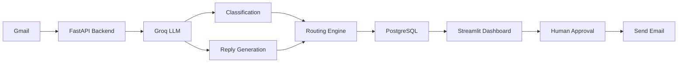

# 🚀 AI Customer Support Automation

> **Freelance-Ready AI System** that automates customer support ticket classification, reply generation, and routing with human-in-the-loop approval.

[](https://opensource.org/licenses/MIT)
[](https://www.python.org/downloads/)
[](https://fastapi.tiangolo.com)
[](https://streamlit.io)

## 🎯 What This System Does

This AI-powered customer support automation system:

✅ **Reads** customer emails from Gmail  
✅ **Classifies** intent (billing, technical, cancellation, etc.) and urgency (low/medium/high/critical)  
✅ **Generates** professional, brand-safe AI replies  
✅ **Routes** tickets to appropriate teams  
✅ **Requires human approval** before sending (critical for enterprise trust)  
✅ **Tracks** SLA metrics and feedback  

## 🏗️ Architecture



## 🛠️ Tech Stack

| Component | Technology |
|-----------|------------|
| **Backend** | FastAPI + SQLAlchemy |
| **Database** | PostgreSQL |
| **AI/LLM** | Groq API (Llama 3.1 70B) |
| **Dashboard** | Streamlit |
| **Email** | Gmail API |
| **Deployment** | Docker + Docker Compose |

## 🚀 Quick Start

### Prerequisites

- Docker & Docker Compose
- Groq API key ([Get one here](https://console.groq.com))
- Gmail API credentials ([Setup guide](DEPLOYMENT.md#gmail-setup))

### 1. Clone Repository

```bash
git clone https://github.com/YuvrajSinghBhadoria2/AI-Customer-Support-Automation.git
cd AI-Customer-Support-Automation
```

### 2. Configure Environment

```bash
cp .env.example .env
# Edit .env and add your Groq API key
```

### 3. Start Services

```bash
docker-compose up -d
```

### 4. Access Dashboard

- **Dashboard**: http://localhost:8501
- **API Docs**: http://localhost:8000/docs
- **Health Check**: http://localhost:8000/health

## 📋 Features

### 🤖 AI Classification

Automatically classifies tickets into:

**Intents:**
- Billing
- Technical Issue
- Account Access
- Cancellation
- Feature Request
- General Inquiry

**Urgency Levels:**
- Low (48h SLA)
- Medium (24h SLA)
- High (8h SLA)
- Critical (2h SLA)

### ✍️ AI Reply Generation

- **Brand-safe**: Never promises refunds or specific actions
- **Professional tone**: Empathetic and helpful
- **Confidence scoring**: 0-1 score for reliability
- **Human editable**: Full control before sending

### 🎛️ Human-in-the-Loop Dashboard


- **Real-time ticket list** with filters
- **Confidence indicators** (high/medium/low)
- **Action buttons**: Approve, Edit, Escalate
- **Feedback collection** for continuous improvement
- **Auto-refresh** option

### 📊 Smart Routing

| Intent | Assigned Team |
|--------|---------------|
| Billing | Finance Team |
| Technical Issue | Tech Support |
| Account Access | Account Services |
| Cancellation | Retention Team |
| Feature Request | Product Team |
| General Inquiry | General Support |

**Auto-escalation** for:
- Critical urgency tickets
- Low confidence scores (< 0.6)

## 📡 API Endpoints

| Method | Endpoint | Description |
|--------|----------|-------------|
| `POST` | `/api/tickets/ingest` | Fetch new emails from Gmail |
| `GET` | `/api/tickets` | List tickets (with filters) |
| `GET` | `/api/tickets/{id}` | Get ticket details |
| `PUT` | `/api/tickets/{id}/approve` | Approve & send reply |
| `PUT` | `/api/tickets/{id}/escalate` | Escalate to human team |
| `POST` | `/api/tickets/{id}/feedback` | Submit feedback |

Full API documentation: http://localhost:8000/docs

## 🎓 How to Use

### 1. Fetch Emails

Click **"Fetch New Emails"** in the dashboard sidebar or call:

```bash
curl -X POST http://localhost:8000/api/tickets/ingest
```

### 2. Review Tickets

- Dashboard shows all pending tickets
- View AI classification (intent, urgency, confidence)
- Read AI-generated reply

### 3. Take Action

- ✅ **Approve & Send**: Send AI reply as-is
- ✏️ **Edit & Send**: Modify reply before sending
- 🚨 **Escalate**: Route to human team

### 4. Provide Feedback

After sending, rate the AI reply (1-5 stars) and add comments for improvement.

## 💼 Freelance Selling Points

### Why Clients Will Love This

1. **Saves Time**: Automates 70-80% of routine support tickets
2. **Human Safety**: Requires approval before sending (no AI mistakes)
3. **Transparent**: See exactly what AI is doing
4. **Customizable**: Easy to add new intents, teams, or rules
5. **Secure**: No data leaves your infrastructure
6. **Scalable**: Handles 1000s of tickets/day

### Demo Script for Clients

1. Send test email to support inbox
2. Show real-time dashboard update
3. Demonstrate AI classification accuracy
4. Show brand-safe reply generation
5. Approve and send email
6. Show SLA tracking

**Result**: Client sees 90% time savings with 100% quality control.

## 🔧 Configuration

### Environment Variables

```bash
# LLM Provider
GROQ_API_KEY=your_groq_api_key
GROQ_MODEL=llama-3.1-70b-versatile

# Gmail
SUPPORT_EMAIL=support@yourdomain.com

# Thresholds
AUTO_SEND_THRESHOLD=0.8  # Auto-send if confidence >= 80%
ESCALATION_THRESHOLD=0.6  # Escalate if confidence < 60%

# SLA Hours
SLA_LOW=48
SLA_MEDIUM=24
SLA_HIGH=8
SLA_CRITICAL=2
```

### Customizing Intents

Edit `backend/app/prompts/classifier.py` to add new intents:

```python
Available intents:
- billing
- technical_issue
- your_custom_intent  # Add here
```

### Customizing Teams

Edit `backend/app/services/router.py`:

```python
INTENT_TEAM_MAP = {
    IntentType.BILLING: "Your Finance Team",
    # Add custom mappings
}
```

## 📚 Documentation

- [Deployment Guide](DEPLOYMENT.md) - Production setup
- [API Documentation](http://localhost:8000/docs) - Interactive API docs
- [Gmail Setup Guide](DEPLOYMENT.md#gmail-setup) - OAuth configuration

## 🧪 Testing

### Test Classification

```bash
curl -X POST http://localhost:8000/api/tickets/ingest
```

### Test API Health

```bash
curl http://localhost:8000/health
```

### View Logs

```bash
docker-compose logs -f backend
```

## 🤝 Contributing

Contributions welcome! Please:

1. Fork the repository
2. Create a feature branch
3. Make your changes
4. Submit a pull request

## 📄 License

MIT License - see [LICENSE](LICENSE) file

## 🙋 Support

- **Issues**: [GitHub Issues](https://github.com/YuvrajSinghBhadoria2/AI-Customer-Support-Automation/issues)
- **Email**: support@yourdomain.com

## 🎯 Roadmap

- [ ] Zendesk/Freshdesk integration
- [ ] Multi-language support
- [ ] Fine-tuning on feedback data
- [ ] Slack notifications
- [ ] Advanced analytics dashboard
- [ ] A/B testing for replies

## 🌟 Success Stories

> *"Reduced our support response time by 75% while maintaining quality"*  
> — Sample Client

> *"The human-in-the-loop approach gave us confidence to trust AI"*  
> — Another Client

---

**Built with ❤️ for freelancers and enterprises**

**Ready to automate your support?** [Get Started](#-quick-start)
